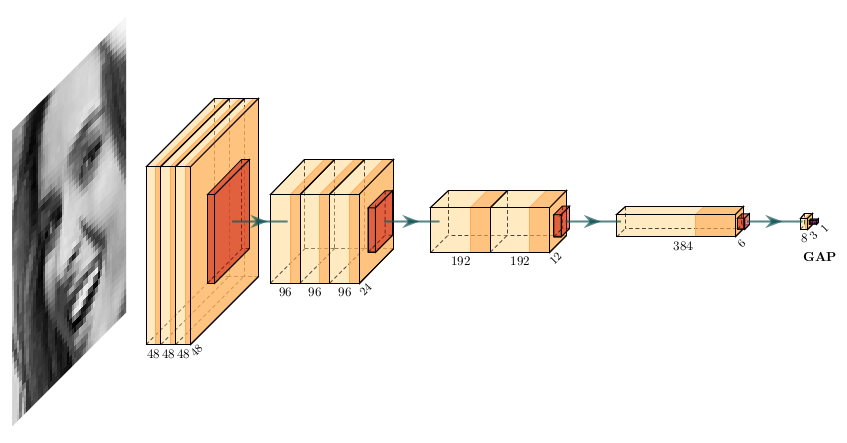
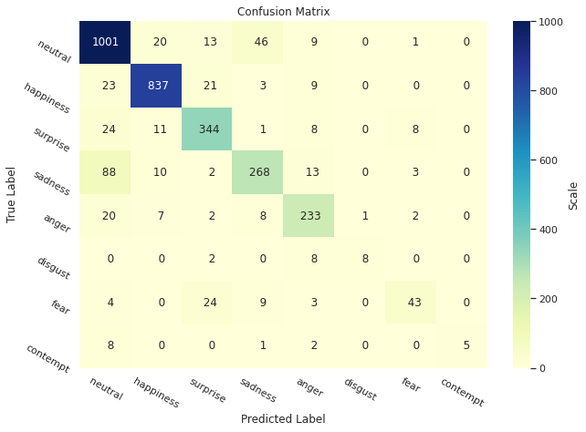

# Facial Emotion Recognition Model

As a continuation of my master's thesis on "*Deep learning in facial emotion recognition*", I built an efficient model for emotion recognition. I trained it on the FER-Plus dataset and created an [Android app](https://github.com/vicksam/fer-app) for it.

### Overview

I've always been interested in both psychology and computers and found the idea that computers can learn social skills really inspiring. It led me to writing my master thesis and to putting it into practice here. Through many experiments and read papers, I've managed to find an effective architecture. And it outperforms models from some of those works.

### Architecture (CNN)

### Results

#### FER-Plus dataset

Here I present performance of my model for majority voting (MV) and probability distribution (PD) labels. Each score is a mean over 5 training runs ± standard deviation.

| Label | Spatial dropout rate | Accuracy        | Loss            | Best result (acc \| loss) |
| :---- | :------------------- | :-------------: | :-------------: | :-----------------------: |
| PD    | 0.10                 | 0.8704 ± 0.0040 | 0.3679 ± 0.0054 | 0.8766 \| 0.3629          |
| MV    | 0.10                 | 0.8656 ± 0.0024 | 0.4152 ± 0.0036 | 0.8687 \| 0.4135          |

The model performs the best when using PD labels. What I mean exactly by this is that I train it on PD labels, but test it using MV labels. It seems that trying to approximate the probability distribution during training, translates to a better score when performing classification later.

#### FER dataset

For a comparison with other models, I also included results on the FER dataset.

| Label | Spatial dropout rate | Accuracy        | Loss            | Best result (acc \| loss) |
| :---- | :------------------- | :-------------: | :-------------: | :-----------------------: |
| MV    | 0.05                 | 0.6857 ± 0.0065 | 0.8820 ± 0.0119 | 0.6945 \| 0.8673          |

#### Comparison with research papers

| Architecture      | Accuracy MV (FER+) | Accuracy PD (FER+) | Accuracy (FER) | Parameters    |
| :---------------- | :----------------: | :----------------: | :------------: | ------------: |
| SHCNN [1]         | -                  | 0.8654             | 0.6910         | 8.71 mil      |
| Mini-Xception [2] | -                  | -                  | 0.66           | ~0.06 mil     |
| VGG13 [3]         | 0.8489             | 0.8543             | -              | ~8.75 mil*    |
| **My result**     | **0.8687**         | **0.8766**         | **0.6945**     | **0.17 mil**  |

My results are the best among the mentioned papers. The model is also very compact compared to the other ones. Although mini-Xception is even smaller, its accuracy is significantly lower.

### How to use

To present how the model works in practice, I've built an [Android app](https://github.com/vicksam/fer-app) that uses it.

If you want to reproduce my results, the notebook file `fer_model.ipynb` is ready to be run on Google Colab. You just need to clone this repo to colab and provide the [FER](https://www.kaggle.com/c/challenges-in-representation-learning-facial-expression-recognition-challenge/) and [FER-Plus](https://github.com/microsoft/FERPlus) datasets. It is quite simple. By following the links, get `fer2013.csv` and `fer2013new.csv` files and put them in the `dataset` directory.

I also provided the trained model files with my best results from the table. You can find them in the `model` directory along with their training history (`.json` documents). The best model is also converted to `.tflite`. And it is the file that I use in the mobile app.

### Papers with biggest impact

The works of Si Miao, et al. [1] and Octavio Arriaga, et al. [2] had a biggest impact on my project. The first one gave me a rough idea on what layer's size and hyperparameter's values could be effective. It also made me stick to *Leaky ReLU* instead of regular *ReLU* activation. Thanks to this, the network could converge at lower loss values than before. From the second paper, I learned how to build an efficient CNN architecture with fewer parameters. It inspired me to use *separable convolution* instead of regular convolution and *global average pooling* instead of a few fully-connected layers. This vastly reduced the number of model's parameters, mainly from dropping FC layers as they account for majority of CNN's parameters.

I applied data pre-processing as in the original FER-Plus paper [3] and also learned from it about different ways of handling the dataset's labels . I decided to use majority voting (MV) and probability distribution (PD) labels as they gave me the best results.

I also experimented with a number of things like:
* ResNet gates, as in [2]
* Probabilistic label drawing, as in [3]
* Concatenating two networks to process in parallel original images with their LBP transformed version [4]

But these approaches didn't bring a significant improvement, at least in my tests.

### Conclusions

If you take a look at the confusion matrix, there are high imbalances in the training set.

It makes the model perform badly when it comes to `disgust`, `fear` and `contempt`, because there are not enough training examples. This can be fixed by using sample weights, so that these classes weigh more, but it would make the overall accuracy go down. On the other hand, you can expect to model to perform the best with `neutral` and `happy` expressions as they have the most examples.

Small number of parameters translates to a small model size. The converted *.tflite* file is only 692 kB which makes it suitable for deploying on mobile devices.

I've experimented with a number of tricks and unconventional approaches that I've found in research papers but with no real improvement. That's why I believe that the way to improve the model is to use a newer CNN architecture.

### Datasets

The original FER dataset was used during kaggle competition on facial expression recognition in 2013. It contains 35,887 of 48x48 grayscale images of human faces. Each picture presents one of 7 emotional states (angry, disgust, fear, happy, sad, surprise or neutral). However, the labeling was not very accurate which limited the possible results.

The labeling was improved in 2016 using crowd sourcing [3]. The original dataset but with new labels was called FER-Plus. This improved version enabled better results and added one additional category (contempt).

### References

[1] Si Miao, et al. *Recognizing Facial Expressions Using a Shallow Convolutional Neural Network*, 2019, DOI: [10.1109/ACCESS.2019.2921220](https://doi.org/10.1109/ACCESS.2019.2921220).\
[2] Octavio Arriaga, et al., *Real-time Convolutional Neural Networks for Emotion and Gender Classification*, 2017, [arXiv:1710.07557](https://arxiv.org/abs/1710.07557).\
[3] Emad Barsoum, et al., *Training Deep Networks for Facial Expression Recognition with Crowd-Sourced Label Distribution*, 2016, [arXiv:1608.01041](https://arxiv.org/abs/1608.01041).\
[4] Biao Yang, et al., *Facial Expression Recognition Using Weighted Mixture Deep Neural Network Based on Double-Channel Facial Images*, 2017, DOI: [10.1109/ACCESS.2017.2784096](https://doi.org/10.1109/ACCESS.2017.2784096).
